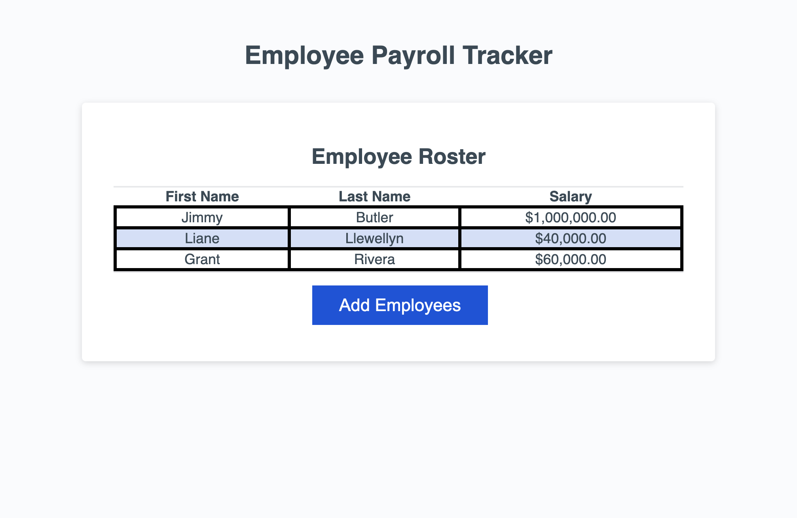
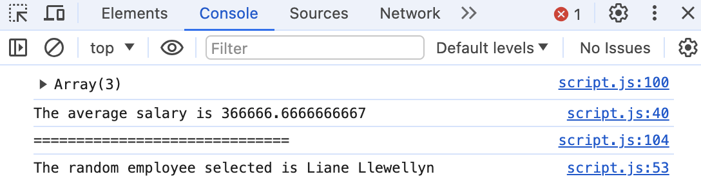

# Employee Payroll Tracker

## Description

This tracker was made to assist a payroll manager in calculating all of their employees salary's, find the average of all the salaries, and then select a random employee using JavaScript.

## Usage

When using this page, the user (payroll manager in this case) will be prompted to input the employee's first name, last name, and salary. They can continue adding more employees after they are prompted "Would you like to continue?" After inserting all of the employees the tracker will aggregate all of the data in a table. In the console log there will be an average salary and a random employee selected.

